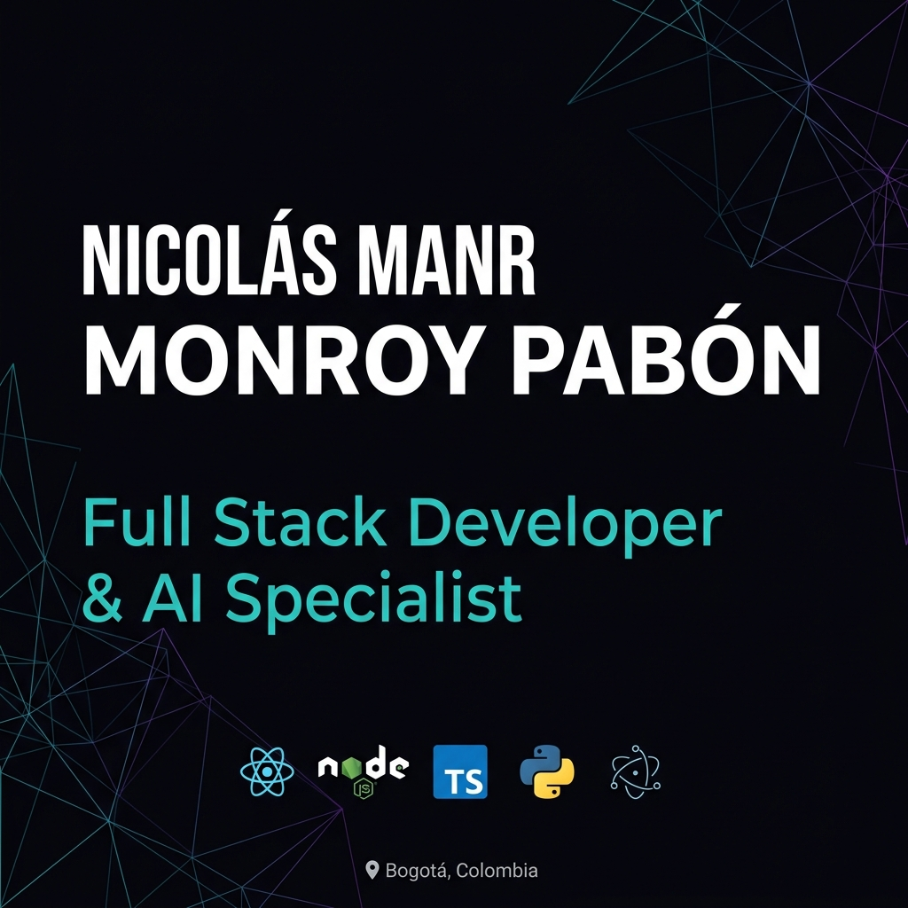

# nicolas<span>●</span>dev — BRAND OS v1.0

<div align="center">
  
</div>

<br />

<div align="center">
  
  
  
  
</div>

<br />

> **"Diseño lo que construyo. Construyo lo que diseño. La creatividad es una función técnica."**

## 💻 Identity // Core System
Este repositorio contiene el **Brand OS** de Nicolás Monroy Pabón. Un ecosistema inmersivo diseñado para demostrar la intersección exacta entre arquitectura de software robusta e implementación estratégica de IA generativa en producción real.

### Technical Specifications
- **Framework:** Next.js 16 (App Router + Turbopack)
- **Engine:** React 19 + Framer Motion (Optimized)
- **Typography:** Space Grotesk + JetBrains Mono (Variable Fonts)
- **Deployment:** GitHub Pages / Automated CI/CD
- **Asset Engine:** Playwright PDF Automation

---

## 🛠️ Logic Stack (The Grid)

| Domain | Technonogies | Specialization |
| :--- | :--- | :--- |
| **Frontend** | React · Next.js · TS · GSAP | Micro-interactions & DX |
| **Backend** | Node · Express · Python · Flask | API Orchestration |
| **Intelligence** | Gemini · Claude · OpenAI | Agentic Workflows & RAG |
| **Data** | PostgreSQL · SQLite · Prisma | Schema Design & Integrity |
| **Native** | Kotlin · Compose · Electron | Cross-platform execution |

---

## 📂 Production Modules
- **[Live Demo](https://nicolasdrawn.github.io/NICOLAS-HYBRID-PORTFOLIO/):** Interface principal con optimización `content-visibility`.
- **[Curriculum Vitae v2](https://nicolasdrawn.github.io/NICOLAS-HYBRID-PORTFOLIO/cv):** Dossier técnico de 3 páginas optimizado para impresión A4.
- **[Cover Letter](https://nicolasdrawn.github.io/NICOLAS-HYBRID-PORTFOLIO/carta):** Estrategia de marca y visión profesional.

---

## ⚙️ Deployment Flow (Local Engine)
```bash
# Clone
git clone https://github.com/NICOLASDRAWN/NICOLAS-HYBRID-PORTFOLIO.git

# Initialize
npm install

# Live Development
npm run dev

# Production Build & PDF Export
npm run build && node print.js
```

---

## 📫 Communication Channels
- **LinkedIn:** [/in/nicolas-monroy-pabon](https://linkedin.com/in/nicolas-monroy-pab%C3%B3n-a8a838176/)
- **Specialized Work:** nicolasmonroypabon@gmail.com
- **WhatsApp Direct:** [+57 315 0135016](https://wa.me/573150135016)

<br />

<div align="center">
  <sub>© 2026 Nicolás Monroy Pabón // Creative Technology & AI Implementation</sub>
</div>
